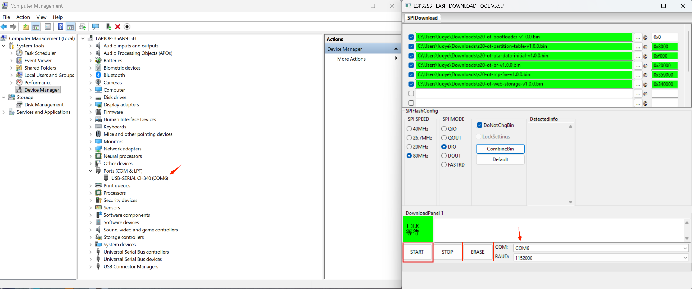
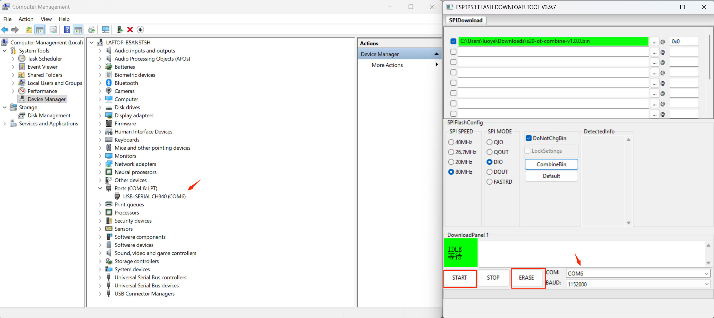

- **Automated build process**

```
$ ./script/ci_build

$ tree build/output/
├── list.txt
├── metadata_v1.0.0
├── s20-ot-bootloader-v1.0.0.bin
├── s20-ot-br-v1.0.0.bin
├── s20-ot-br-v1.0.0.elf
├── s20-ot-combine-v1.0.0.bin
├── s20-ot-flash-args-v1.0.0.txt
├── s20-ot-ota-data-initial-v1.0.0.bin
├── s20-ot-partition-table-v1.0.0.bin
├── s20-ot-rcp-fw-v1.0.0.bin
└── s20-ot-web-storage-v1.0.0.bin
```

The binary files will generate in `build/output`.

## Flashing by GUI tool

Click the link https://www.espressif.com/en/support/download/other-tools to download `Flash Download Tools`.

1. Extract flash_download_tool, and execute flash_download_tool.exe.


2. Select ESP32-S3,then click OK.


3. For Flash binary files, you can choose either the "Flashing multi-binary" or "Flashing combine binary" method according to your needs.

First, select serial port then erase the flash and start flashing. The flash address can be found in the file `s20-ot-flash-args-v1.0.0.txt`

- Flashing multi-binary



- Flashing combine binary


